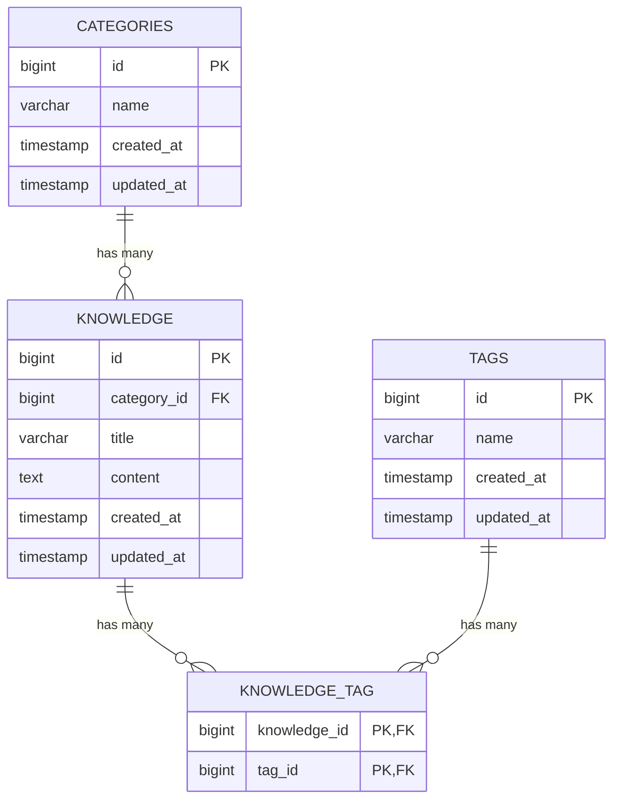

# 技術ナレッジ管理システム

## 概要
勉強したことを蓄積する。

## ＥＲ図

```mermaid
erDiagram
    CATEGORIES ||--o{ KNOWLEDGE : "has many"
    KNOWLEDGE ||--o{ KNOWLEDGE_TAG : "has many"
    TAGS ||--o{ KNOWLEDGE_TAG : "has many"

    KNOWLEDGE {
        bigint id PK
        bigint category_id FK
        varchar title
        text content
        timestamp created_at
        timestamp updated_at
    }

    CATEGORIES {
        bigint id PK
        varchar name
        timestamp created_at
        timestamp updated_at
    }

    TAGS {
        bigint id PK
        varchar name
        timestamp created_at
        timestamp updated_at
    }

    KNOWLEDGE_TAG {
        bigint knowledge_id PK,FK
        bigint tag_id PK,FK
    }
```